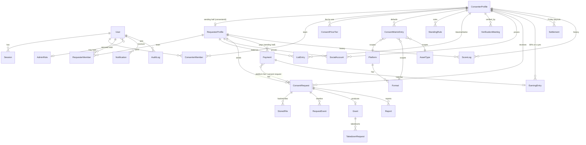

# ARCHITECTURE.md

## Overview

Consent is a Next.js App Router monolith: server components for reads, server actions for writes,
route handlers for binary/public outputs (signed files, certificate/invoice/dossier PDFs, badge
SVG, jobs tick). Authorization is enforced in three layers:

1. **Session layer** — cookie sessions (hashed tokens in DB), TOTP gating (`totpPassed`), banned /
   suspended checks (`src/lib/auth.ts`).
2. **Context layer** — every account is the same, and a profile is a **pair** (see below).
   `requireConsenter(perm?)` and `requireRequester()` both resolve the SAME active profile (from
   the session's `activeProfile`, `"consenter:<profile id>"`): one returns its receiving half, the
   other its sending half (created on demand). Granular permissions (`canApprove`, `canEditRules`,
   `canExport`, `canManageTeam`) come from the seat. TOTP 2FA is required for every account.
   `requireAdmin(module, perm)` checks RBAC roles.
3. **Row layer** — every action re-checks that the target row belongs to the resolved profile.

Background work is a set of idempotent sweeps (the 7-day request window: reminders, expiry and
close; grant expiry notices/expiry; takedown windows; the escrow sweep; Friday payouts; membership
reminders only while the membership fee is on) run by a worker loop, cron endpoint, or admin button.

## One account type: the profile pair

Every account is the same and can both ask and be asked. In the database a **profile** is a
`ConsenterProfile` (the canonical id: public page `/c/<slug>`, terms, consent request fee, limits,
earnings, receiving) plus its **sending half**, a `RequesterProfile` linked by `consenterId`
(requests it sends, payments, membership). Onboarding creates both in one transaction with OWNER
seats in both member tables; the ID check approves both at once (`syncPair`); team changes write
both (`mirrorMember` / `removeMember`). Older unpaired rows are paired on first use
(`ensureAsker`, `ensureProfileFor`). All of this lives in `src/lib/profiles.ts` (pure helpers in
`profiles-pure.ts`). People see one **Consent Score** per profile: `profileScore()`, the average of
the answering part (`ConsenterProfile.score`) and the asking part (`RequesterProfile.score`).

## Key flows

**Request lifecycle** — `Draft → (free: sent at once | paid: one checkout for the consent request
fee + the 20% platform fee) → Submitted → [standing rules → matrix] → Denied | Approved | Pending`.
From Pending the person asked can **Approve** (optionally narrowing the scope or adding a short
condition), **Ask** a question (CHANGES_REQUESTED; the answer puts it back to Pending) or
**Decline**; the asker can **Withdraw**. Approval goes through one helper, `approveAndIssue()`
(`src/lib/requests.ts`), used by both the manual and the automatic yes: it issues the certificate
at once when the final content file is uploaded (APPROVED), else the request waits in
APPROVED_IN_PRINCIPLE until it is. Every open request ends after 7 days without action
(EXPIRED_NO_RESPONSE when the person asked was silent, else CLOSED). After the certificate:
revocation, takedowns and expiry. Approval binds to SHA-256 hashes computed server-side at upload;
a new file version never inherits a grant.

**Money** — `consentPriceFor()` picks the fee (per-use tier or base; null = free).
`startRequestCheckout()` charges the consent request fee (CONSENT_PRICE, held as an
`EarningEntry`) and the platform fee (PER_REQUEST, 20% of it, plus tax where the payer's country
has one) on one provider checkout; a free ask skips checkout entirely. `syncConsentPrice()`
(`src/lib/escrow.ts`) releases 80% to the profile on a yes or refunds 80% otherwise. Membership
(MEMBERSHIP, per-country `PriceConfig`) is only charged while `membershipFeeOn` is set; `canSend()`
(`src/lib/membership.ts`) gates sending. Per-currency minimums live in `Currency`.

**Certificate** — `issueGrant()` builds a canonical JSON payload (sorted keys), signs with the
platform Ed25519 key, stores payload+signature on the `Grant`. The public page `/v/{publicId}`
re-verifies the signature on every load and offers a WebCrypto client-side file hash checker.
Stored payloads are never changed: older certificates still carry `fee` and `agreementMode`
fields, which every reader treats as optional and no page shows.

**Audit log** — append-only, hash-chained (`hash = sha256(prevHash + canonical entry)`), verified
by walking the chain (`verifyAuditChain`, surfaced in `/admin/audit` and `/admin/settings`).

**Consent Score** — two parts per profile (how it answers, how it asks), recalculated on events and
by sweeps from live aggregates with admin-editable weights (`Setting` table); every change is
written to `ScoreLog` with its reason. People see one number, `profileScore()`.

**ID check** — one queue at `/admin/consenters` ("Profiles"). Approve, reject or "more info" write
both halves in one transaction. A possible duplicate (legal name, document number or channel)
blocks approval until cleared; a verification call can be scheduled but is optional.

## ER diagram (core)

Supporting tables not drawn: `OtpCode`, `TeamInvite`, `PriceConfig` (membership price + tax per
country), `Currency` (per-currency minimum consent request fee), `Coupon`, `Setting`,
`MessageTemplate`, `CmsPage`, `OutboxMessage` (mock email/SMS), `Job`, `ExportLog`,
`IntentCategory`, `DenialReason`, `AppInvite`, `PublicTipOff`, `RequestMessage` (old rows only,
not shown).

## Design system

Strict monochrome glassmorphism (see `src/app/globals.css`): white canvas with soft gray radial
ambience, translucent blurred surfaces (`.glass`, `.glass-strong`, `.glass-bar`, `.glass-ink`),
hairline borders, no color anywhere. Status is communicated by **shape and fill**, never hue:
solid ink = positive/complete, outline = in progress, dashed = waiting, strikethrough = terminal,
warning triangle = expired/ignored. Navigation is a floating glass top bar on desktop and a fixed
**bottom nav** on mobile (thumb-reachable), the same for every profile: Home (`/c-panel`), Find,
Requests (received and sent), Alerts, Profile. The profile switcher appears only for people who
belong to more than one profile.

## Search

`searchProfiles()` (`src/lib/search.ts`) lists every verified profile, using Postgres `pg_trgm`
similarity + ILIKE across display name, legal name, aliases, categories and social handles (on
either half), ranked by greatest similarity. It powers Find, the public directory and the invite
panel. The function is the seam for a future Meilisearch/Typesense swap.

## Upgrade paths

- Storage → S3/R2: implement `StorageProvider` with pre-signed URLs.
- Payments → Stripe/Razorpay: implement `PaymentProvider.createCheckout` + webhook calling
  `settlePayment` (already idempotent).
- Email/SMS → Resend/Twilio/MSG91: implement `EmailProvider`/`SmsProvider`.
- Queue → BullMQ: re-point the sweep triggers; Redis is already in docker-compose.
