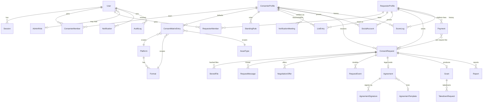

# ARCHITECTURE.md

## Overview

Consent is a Next.js App Router monolith: server components for reads, server actions for writes,
route handlers for binary/public outputs (signed files, certificate/invoice/dossier PDFs, badge
SVG, jobs tick). Authorization is enforced in three layers:

1. **Session layer** — cookie sessions (hashed tokens in DB), TOTP gating (`totpPassed`), banned /
   suspended checks (`src/lib/auth.ts`).
2. **Context layer** — `requireConsenter(perm?)` / `requireRequester()` resolve the active profile
   from the session's profile switcher and the user's membership + granular permissions;
   `requireAdmin(module, perm)` checks RBAC roles. Consenter membership enforces TOTP.
3. **Row layer** — every action re-checks that the target row belongs to the resolved profile.

Background work is a set of idempotent sweeps (SLA reminders/expiry, negotiation idle close, grant
expiry notices/expiry, takedown windows, subscription reminders) run by a worker loop, cron
endpoint, or admin button.

## Key flows

**Request lifecycle** — `Draft → (pay per-request fee) → Submitted → [standing rules → matrix] →
Auto-decided | Pending → … → Approved (grant issued)`. The fee settlement callback
(`settlePayment → onRequestPaid`) runs rule evaluation (`src/lib/rules.ts`). Approval binds to
SHA-256 hashes computed server-side at upload; a new file version never inherits a grant.

**Certificate** — `issueGrant()` builds a canonical JSON payload (sorted keys), signs with the
platform Ed25519 key, stores payload+signature on the `Grant`. The public page `/v/{publicId}`
re-verifies the signature on every load and offers a WebCrypto client-side file hash checker.

**Audit log** — append-only, hash-chained (`hash = sha256(prevHash + canonical entry)`), verified
by walking the chain (`verifyAuditChain`, surfaced in `/admin/audit` and `/admin/settings`).

**Consent Score** — recalculated on events and by sweeps from live aggregates with admin-editable
weights (`Setting` table); every change is written to `ScoreLog` with its reason.

## ER diagram (core)

Supporting tables not drawn: `OtpCode`, `TeamInvite`, `PriceConfig`, `Coupon`, `Setting`,
`MessageTemplate`, `CmsPage`, `OutboxMessage` (mock email/SMS), `Job`, `ExportLog`,
`IntentCategory`, `DenialReason`.

## Design system

Strict monochrome glassmorphism (see `src/app/globals.css`): white canvas with soft gray radial
ambience, translucent blurred surfaces (`.glass`, `.glass-strong`, `.glass-bar`, `.glass-ink`),
hairline borders, no color anywhere. Status is communicated by **shape and fill**, never hue:
solid ink = positive/complete, outline = in progress, dashed = waiting, strikethrough = terminal,
warning triangle = expired/ignored. Navigation is a floating glass top bar on desktop and a fixed
**bottom nav** on mobile (thumb-reachable), with a prominent center action where it matters.

## Search

`searchConsenters()` uses Postgres `pg_trgm` similarity + ILIKE across display name, legal name,
aliases and social handles, ranked by greatest similarity. The function is the seam for a future
Meilisearch/Typesense swap.

## Upgrade paths

- Storage → S3/R2: implement `StorageProvider` with pre-signed URLs.
- Payments → Stripe/Razorpay: implement `PaymentProvider.createCheckout` + webhook calling
  `settlePayment` (already idempotent).
- Email/SMS → Resend/Twilio/MSG91: implement `EmailProvider`/`SmsProvider`.
- E-signature → DocuSign/Leegality/Digio: replace the in-app typed-name+OTP signature step in
  `agreement-actions.ts`.
- Queue → BullMQ: re-point the sweep triggers; Redis is already in docker-compose.
